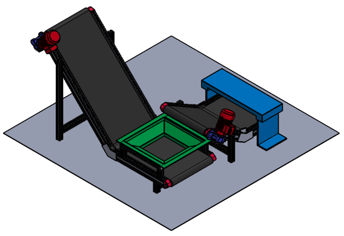
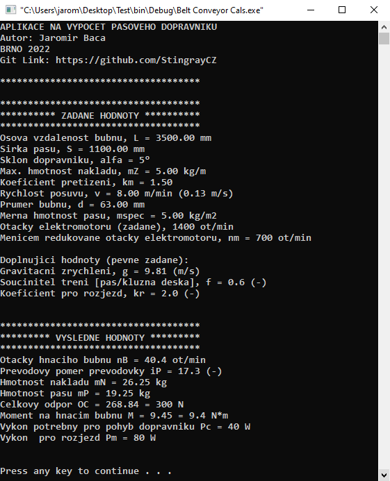
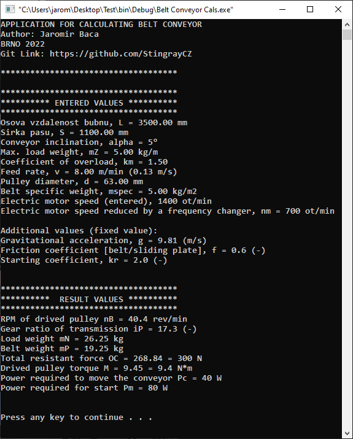
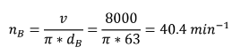
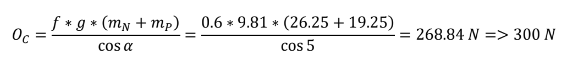

# Belt Conveyor CalcApp

The development of each device is preceded by the phase of creating a concept. When it is necessary to roughly outline the shape of the machine and specify it operating properties and perform calculations. Such a calculation can consist of several formulas and the classical doing calculation on the paper can be very lengthy and prone to errors. Especially if the inputs data or concept changes and a new one cals needs to be done again.

The task of the application is calculating the basic parameters of the belt conveyor. That is driven by an electric motor and the torque is transmitted by means of a worm drive a on a driven cylinder. For choosing a suitable engine and gearbox it is necessary to calculate the required power and gear ratio.


<p float="left">
  
</p>

In the image below, we see the interface of the application. TThe input data and the resulting values are shown here together for better clarity. The application is created in two language versions. Language switching is possible using```#DEFINE``` v header file _Header.h_.

<p float="left">
  
  
</p>


The application will gradually ask for input values and then perform a calculation in the background. Then the app displays the results. For better clarity, the gradual questioning method (see below) is chosen.

The code of the app is divided into three files and a header.

* main.c
* EnterValues.c
* Formulas.c
* EnterValues.c

## Main.c

The main application file. It executes the functions from the  _EnterValues.c_ a _Formulas.c_. It contains the code to display the  results and save them to a text file (.txt).

```C
#ifdef LANG_EN
fPointer = fopen("Report - Belt Conveyor (EN lang).txt", "w");
```

## EnterValues.c

This block contains data entry functions. This is handled as a cascade using the ```case``` function. This achieves sequential querying and at the same time deleting the previous query.

```C
for(i = 1; i <= 9; i++)
    {
        grade = i;
        switch(grade)
        {
        case 1 : // Osova vzdalenost bubnu (mm)
        ...
        break;
        
        case 2 : //Sirka pasu (mm)
        ...
        
        ...
```

## Forumulas.c

The implementation of formulas in the C language is solved by a method where each formula is represented as a function. Each function has
defined input and output variables. Specifically, in the example below, we can notice the use of PI variables (Ludolphian
number which is defined in the header file).

**RPM of drived pulley nB(ot/min)**
<p float="center">
  
</p>

```C
void FormulaA(float *v, float *d, float *result){

    *result = ((*v)*1000) / ((float)PI * (*d));
}
```

**Total resistant force OC(N)**
<p float="center">
  
</p>

```C
void FormulaE(float *nM, float *mP, float *alpha, float *result){

    if((*alpha) == 90){

        *result = (((float)FRIC * (float)GFORCE * ((*nM) + (*mP))) / (cos((*alpha - 1) * RAD))) * 2;   // Special case for 90deg
    }
    else{
        *result = ((float)FRIC * (float)GFORCE * ((*nM) + (*mP))) / (cos((*alpha) * RAD));
    }
}
```


## Header.h


A header file contains definitions of constants, linkers for functions, etc. There is also an option to change the language of the application.


```C
//#define LANG_EN
#define LANG_CZ
```

```C
#define PI 3.141592654          // Ludolphian number
#define GFORCE 9.81             // Gravitational acceleration
#define RAD ((double)PI /180)   // Angle in radians
```

```C
#define FRIC 0.6                // Coefficient of friction (-)
#define KR 2                    // Coefficient for starting movement (-)
```