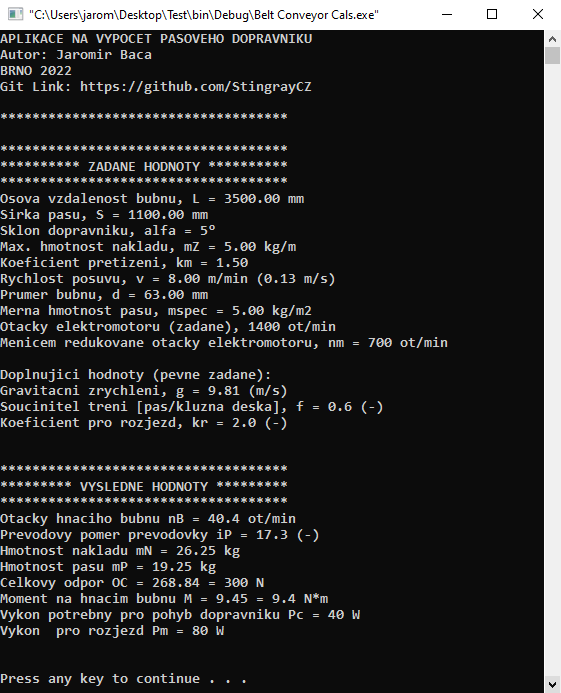
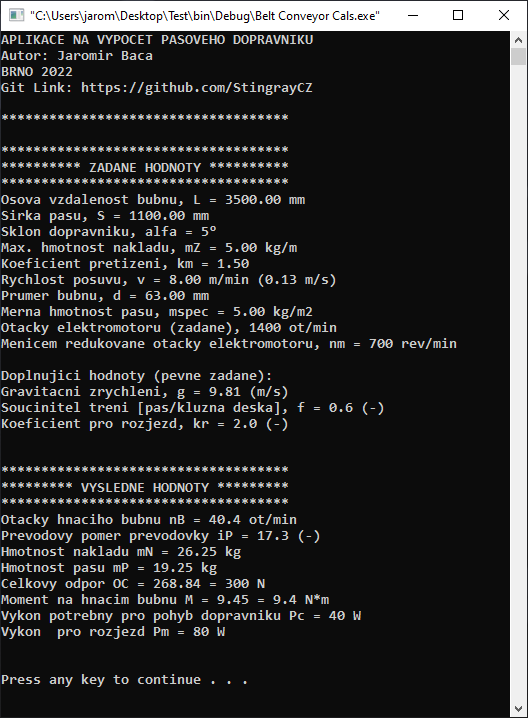

# Belt Conveyor CalcApp

Vývoji každého zařízení předchází fáze tvorby konceptu, kdy je potřeba si zhruba načrtnout podobu stroje, specifikovat provozní vlasnosti a provést výpočty. Takový výpočet se může skládat z několika vzorců a klasické počítání výpočtu na papír může být velice zdlouhavé. Zvlášť pokud se zadání nebo koncept mění a je potřeba provést nový výpočet. Pro urychlení vývoje byla vytvořena aplikace, která funguje tak, že se postupně zeptá na vstupní hodnoty a následně na pozadí provede výpočet. Poté zobrazí výsledky. 

  
  

